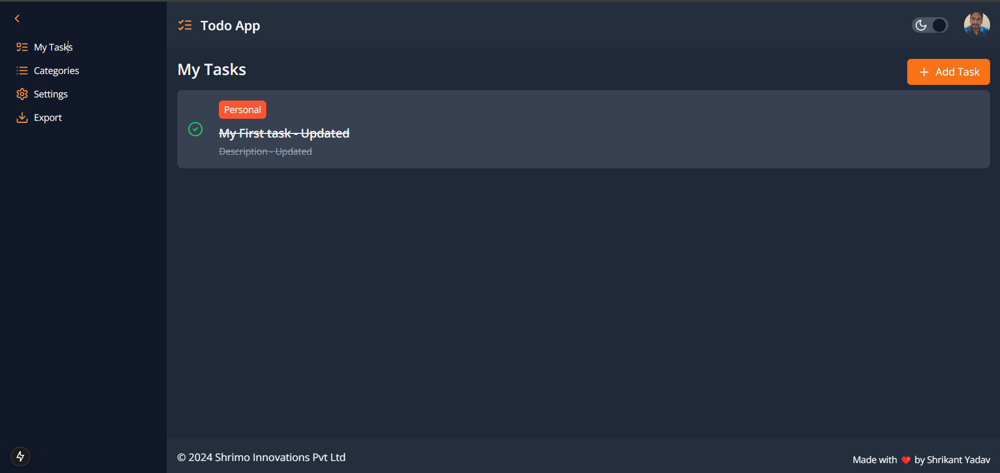
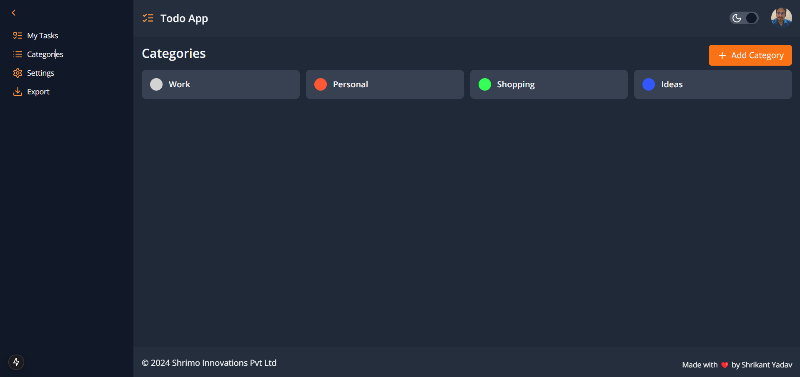
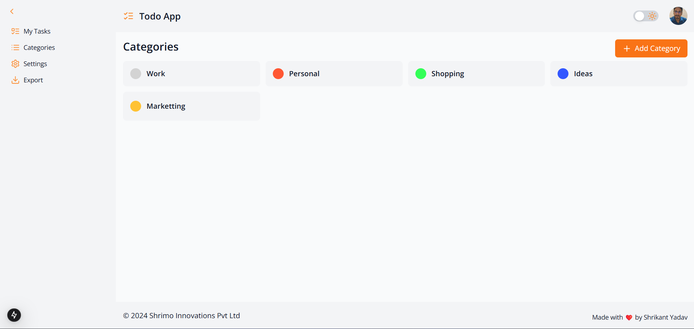
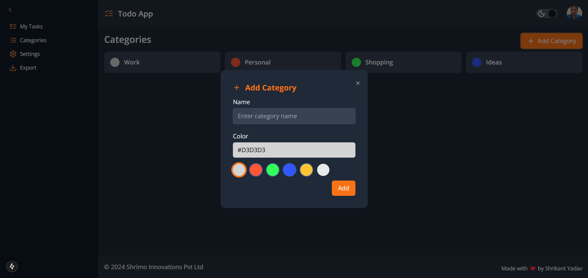
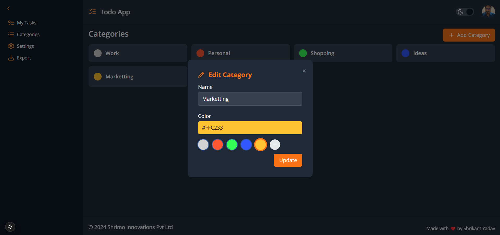
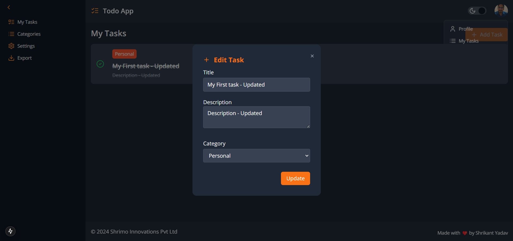

# Todo List Application | Next JS 15

A simple and efficient Todo List application built using Next.js 15 and React. This application allows users to manage their tasks, categories, and preferences with an intuitive and user-friendly interface.

## Demo 
[Todo List App - Live](https://shrikant9907.github.io/todo-list-next-js-15)

## Features

- **My Tasks Page**: View and manage all your todos in one place.
- **Categories Page**: Organize todos by categories with customizable colors.
- **Add Category Modal**: A modal to add new categories.
- **Edit Category Modal**: A modal to edit existing categories.
- **Add Task Modal**: A modal to create new tasks.
- **Edit Task Modal**: A modal to edit existing tasks.
- **Categories with Color Option**: Categorize your todos with different colors for better visual organization.
- **Mark as Completed**: Mark tasks as completed with a simple click.
- **Dark / Light Mode**: Switch between dark and light themes for a better user experience.
- **LocalStorage Support**: Todos, categories, and theme preferences are saved in local storage for persistence.
- **Import / Export**: Import or export your todo list data in JSON format.
- **SEO Optimized**: The app is SEO-friendly, ensuring better visibility on search engines.
- **Responsive Design**: The app is fully responsive and works seamlessly on both desktop and mobile devices.

## Screenshot of Each Page

### My Tasks Page

### Categories Page (Dark Mode)

### Categories Page (Light Mode)

### Add Category Modal

### Edit Category Modal

### Edit Task Modal

## Built With

- [Next.js 15](https://nextjs.org/)
- [React](https://reactjs.org/)
- [Tailwind CSS](https://tailwindcss.com/)

## Created By

**Shrikant Yadav**  
Full Stack Web Developer  
[LinkedIn Profile](https://www.linkedin.com/in/shrikant9907/)

## Training Programs

We provide the following training programs in Web Design and Development:

- **MERN Stack Development**: [Learn More](https://shrimo.com/courses/web-development/full-stack-web-dev-basic-to-advanced)
- **Full Stack Development**: [Learn More](https://shrimo.com/courses/web-development/full-stack-web-dev-basic-to-advanced)
- **React JS Development**: [Learn More](https://shrimo.com/courses/web-development/frontend-react-js-mastery-basic-to-advanced)
- **Node JS Development**: [Learn More](https://shrimo.com/courses/web-development/full-stack-web-dev-basic-to-advanced)

Programs range from 3 months to 1 year. 

For more information on training, feel free to contact me.

## Web Developer Services

We also offer Web Developer services, including custom web development, design, and consultation for various projects.

## Contact Details

- Email: [info.shrimo@gmail.com](mailto:info.shrimo@gmail.com)
- Phone: +91 9907472038
- Location: Near Gas Godown, Collectorate Main Road, Kothi Bazar, Narmadapuram, (M.P.)

For services or training, contact us at:

- **Company Name**: Shrimo Innovations Pvt Ltd
- **Website**: [https://shrimo.com/](https://shrimo.com/)

## Online/Offline Training

Looking to advance your web development career? Join our online and offline training programs available in Hoshangabad (Narmadapuram) and beyond. Learn everything from basic to advanced concepts in Full Stack and MERN Stack development with practical hands-on projects. Enroll today and start building your career!

## License

This project is open source and available under the [MIT License](LICENSE).
